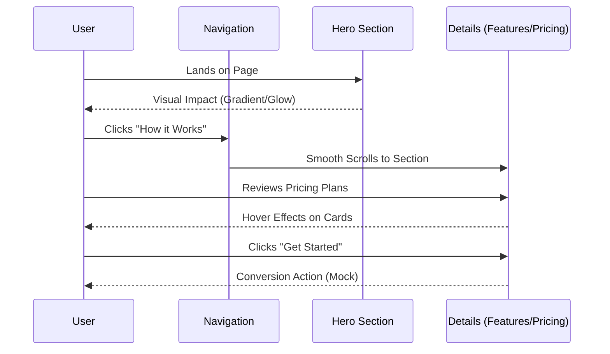

# AI Tutor - Your Personal Learning Assistant


## AI Tutor Header

**Master any subject with personalized AI guidance.**

Built with HTML, CSS, and Vanilla JavaScript.

---

## 📖 Overview

**AI Tutor** is a modern, responsive landing page template for an educational AI platform. Designed with a "Premium Dark" aesthetic, it features glassmorphism effects, smooth scroll animations, and a fully responsive layout.

The project has been optimized as a **Static Site**, ensuring lightning-fast performance and easy deployment to platforms like GitHub Pages.

## 🏗️ Architecture

The project follows a simple, monolithic static architecture for maximum compatibility and ease of use.

```mermaid
graph TD
    User[User Browser]
    
    subgraph "Static Deployment (GitHub Pages)"
        Index[index.html]
        Styles[style.css]
        Script[script.js]
        Assets[Assets (/vite.svg)]
    end
    
    User -->|Requests| Index
    Index -->|Links| Styles
    Index -->|Loads| Script
    Index -->|Displays| Assets
```

## 🗺️ User Flow

The landing page guides the user through a structured narrative, from initial hook to conversion.



## ✨ Features

- **🎨 Premium Design**: High-end dark theme with "Inter" and "Outfit" typography.
- **🔮 Glassmorphism**: Trendy frosted glass effects on cards and headers.
- **📱 Fully Responsive**: Grid layouts that adapt perfectly to mobile, tablet, and desktop.
- **⚡ High Performance**: Zero dependencies, pure Vanilla JS and CSS.
- **🎭 Micro-interactions**: Smooth hover states, gradient text, and scroll-triggered fade-ins.

## 📂 Project Structure

```bash
/
├── index.html      # Main semantic HTML structure
├── style.css       # Consolidated styles (Variables, Reset, Components)
├── script.js       # Interaction logic (Smooth scroll, Animations)
└── vite.svg        # Project icon
```

## 🚀 Getting Started

### Run Locally
Since this is a static site, you don't need `npm` or `build` steps!

1.  **Clone the repository**
2.  **Open `index.html`** in your browser.
    *   *Tip: Use "Live Server" extension in VS Code for the best development experience.*

### Deployment
To deploy to **GitHub Pages**:

1.  Go to your repository **Settings**.
2.  Navigate to **Pages**.
3.  Select `main` branch as the source.
4.  Save and wait for the link!

---

© 2024 AI Tutor. All rights reserved.
